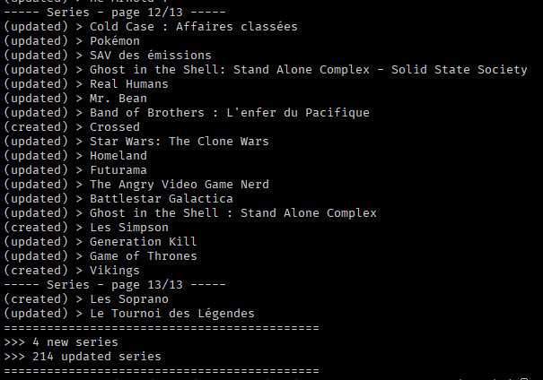

# SensCritique Exporter

Script pour exporter votre collection de films/séries/libres/BD/albums/jeux depuis SensCritique vers une base de données locale *(SQLite par défaut)*.

<hr>

SensCritique fait miroiter une API depuis bientôt 10 ans, et toujours rien à l'horizon :
- [2021](https://senscritique-com.medium.com/cest-pr%C3%A9vu-mais-on-n-a-pas-encore-de-date-%C3%A0-donner-9ccfc68d1c60)
- [2019](https://senscritique.eu.helpdocs.com/suggestions/api-ouverte-a-tous)
- [2015](https://www.nextinpact.com/article/18915/96073-sens-critique-genese-aux-projets-a-venir)

En plus de ça, [l'ancien site](https://old.senscritique.com/) ferme le 30/10/2023, alors qu'il héberge le wiki qui permet d'éditer les oeuvres, qui n'a pas d'équivalent sur le nouveau site. *(le wiki inclut des données non-présentes sur le nouveau site, notamment l'identifiant IMDB pour les films)*

Du coup, script fait-maison pour tout exporter dans une base de données propre, pour éventuellement plus tard importer les films sur Letterboxd [*(API publique disponible)*](https://api-docs.letterboxd.com/).

<hr>

### Installation

- Renommer le ficher `app/config/config.yaml.example` en `app/config/config.yaml`
	- Remplir les valeurs :
		- `username`
		- `SC_AUTH`
		- `SC_AUTH_ID`

- Installer les dépendances :
```bash
bundle install
```

- Exécuter le script :
```bash
ruby app/main.rb
```

<hr>

### Dépendances

- ActiveRecord *(Rails)*
- Nokogiri
- Faraday

<hr>

### Images



<hr>

### Format des données


<details>
<summary>movies</summary>

| id | title | sc_url_id | sc_url_name | imdb_id | director | country | rating | status | category | original_title | release_date | duration | watched_on |
|---|---|---|---|---|---|---|---|---|---|---|---|---|---|
| 1 | Bienvenue à Gattaca | 488559 | bienvenue_a_gattaca | tt0119177 | Andrew Niccol | Etats-Unis | 10 | 1 | Film | Gattaca | 1997-24-10 | 106 | 2023-10-29 |

</details>


<details>
<summary>series</summary>

| id | title | sc_url_id | sc_url_name | creator | country | rating | status | category | original_title | release_date | seasons |
|---|---|---|---|---|---|---|---|---|---|---|---|
| 1 | Succession | 32576517 | succession | tt0119177 | Jesse Armstrong | Etats-Unis | 8 | 1 | Série | NULL | 2018-06-03 | 4 |

</details>


<details>
<summary>books</summary>

| id | title | subtitle | sc_url_id | sc_url_name | original_title | author | country | rating | status | isbn | release_date |
|---|---|---|---|---|---|---|---|---|---|---|---|
| 2 | Les Enfants de Dune | Le Cycle de Dune, tome 3 | 384226 | les_enfants_de_dune | The Children of Dune | Frank Herbert | Etats-Unis | 9 | 1 | 9782266235822 | 2018-06-03 |

</details>


<details>
<summary>comics</summary>

| id | title | sc_url_id | sc_url_name | original_title | author | illustrator | country | rating | status | category | isbn | release_date |
|---|---|---|---|---|---|---|---|---|---|---|---|---|
| 2 | Appleseed | 17433205 | appleseed | Appurushīdo | Masamune Shirow | Masamune Shirow | NULL | NULL | 3 | Manga | 978-2-8769-5228-7 | 1985-02-01 |

</details>


<details>
<summary>albums</summary>

| id | title | sc_url_id | sc_url_name | artist | rating | status | release_date |
|---|---|---|---|---|---|---|---|
| 5 | Ascend | 30723739 | ascend | Pogo | 9 | 1 | 2018-02-22 |

</details>


<details>
<summary>videogames</summary>

| id | title | sc_url_id | sc_url_name | developer | publisher | rating | status | category | original_title | release_date |
|---|---|---|---|---|---|---|---|---|---|---|
| 33	 | Factorio | 8459949 | factorio | Wube Software LTD. | Wube Software LTD. | 10 | 1 | Jeu | NULL | 2020-08-14 |

</details>